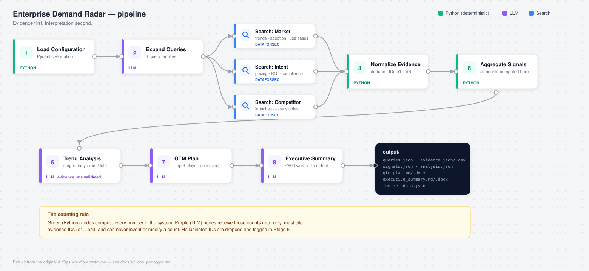

# Enterprise Demand Radar

**Search intelligence → buying-cycle detection → prioritized GTM actions.**

A runnable CLI that continuously researches a market, detects enterprise
buying signals, classifies buying-cycle shifts, monitors competitor GTM
activity, and converts the evidence into prioritized GTM recommendations.

```bash
demand-radar run --config config/example.yaml
```



## What It Does

Given a brand, seed keywords, competitors, and ICP roles, the radar:

1. Expands seeds into market, intent, and competitor search queries (LLM)
2. Executes the searches (pluggable search provider)
3. Normalizes and deduplicates results into evidence rows with stable IDs (Python)
4. Counts theme, query-type, and domain signals deterministically (Python)
5. Classifies trends, buying-cycle stage, and competitor moves (LLM, evidence-referenced)
6. Produces a Markdown GTM plan with a prioritized Top 3 plays (LLM)
7. Prints a ≤500-word executive summary and saves all artifacts to `output/`

## Why I Built It

Demand generation decisions are usually argued from anecdote. I wanted a
system where every GTM recommendation traces back to a countable, inspectable
evidence row — and where the counting is done by code that can be tested, not
by a model that can hallucinate. It's the same discipline I apply to client
work: confidence has to match evidence.

## Project Inspiration: From AirOps Prototype to CLI

V1 of this system was an AirOps workflow built around an ElevenLabs
enterprise marketing use case; I then used it for Pontiac DSP, where it
accelerated our GTM efforts. This repository is the ground-up rebuild as a
standalone, testable Python package — same pipeline shape, no AirOps
dependency. The full story, including the original workflow diagram and the
reasons for the rebuild (portability, testability, evidence integrity,
provider independence, version control, model routing, future CRM/analytics
joins), is in [`docs/air_ops_prototype.md`](docs/air_ops_prototype.md).

## Architecture

The workflow diagram above shows the eight stages: config validation feeds
LLM query expansion, which fans out into market/intent/competitor search
branches (DataForSEO) that merge into deterministic normalization and signal
aggregation, before the three LLM interpretation stages produce the GTM plan
and executive summary. Green nodes are deterministic Python; purple nodes are
LLM tasks constrained to Python-computed counts and validated evidence IDs.

Full module map and stage detail: [`docs/architecture.md`](docs/architecture.md).

## Evidence First, Interpretation Second

The architectural principle of the whole system:

> **Evidence first. Interpretation second.**

Deterministic Python owns search-result processing, URL normalization,
deduplication, evidence IDs, keyword/theme matching, counts, aggregation,
timestamps, and persistence. The LLM owns query expansion, trend
interpretation, buying-stage classification, competitor interpretation, GTM
recommendations, and the executive summary.

**The LLM never invents signal counts.** Counts are computed in
`processing/signals.py`, passed to the model as read-only input, and the
prompts forbid modifying them. Every LLM conclusion must reference evidence
IDs (`e1`, `e2`, …); IDs that don't exist are dropped and logged by the
pipeline's reference validator.

## How Buying Signals Are Classified

| Stage | The buyer is… |
|---|---|
| **Early** | learning about the category, opportunity, use case, or strategic viability |
| **Mid** | evaluating economics, implementation, integration, security, compliance, or requirements |
| **Late** | comparing vendors, examining proof, benchmarking performance, consuming case studies, or preparing procurement |

The trend-analysis stage assigns each detected buying signal one of these
stages, with supporting evidence IDs, into `output/analysis.json`.

## Configuring Your Own Brand

[`config/example.yaml`](config/example.yaml) is a template, not a market:
placeholder brand, keywords, competitors, and ICP roles, with comments
explaining what each field drives. Copy it, fill it in, and you are running
your own market — nothing in the repo is tied to a particular company.

```bash
cp config/example.yaml config/mybrand.local.yaml
# edit brand_name, base_keywords, competitors, icp_roles
demand-radar demo --config config/mybrand.local.yaml   # dry run, no API spend
demand-radar run  --config config/mybrand.local.yaml   # live
```

`config/*.local.yaml` is gitignored, so a config named that way can hold your
real brand and competitor list without risk of committing it — useful if you
forked this repo and push to your own remote.

The one thing worth tailoring beyond the obvious fields is the **theme
taxonomy**. Themes are how the radar turns raw results into counts, and those
counts are the only figures the LLM is allowed to cite — so they are the lens
the whole run sees your market through. [`config/themes.yaml`](config/themes.yaml)
ships generic B2B buying signals (pricing/ROI, compliance, performance
validation, vendor evaluation, and so on) that work in any category. Copy it,
swap in your market's vocabulary, and point `themes_file:` at your version.
Stage 5 warns when fewer than 40% of evidence rows match any theme, which is
the signal your taxonomy does not fit what is being searched.

## Quickstart

```bash
git clone https://github.com/afllewellyn/Brand-GTM-Market-Intelligence.git
cd Brand-GTM-Market-Intelligence
python -m venv .venv && source .venv/bin/activate
pip install -e ".[dev]"

# no keys needed:
demand-radar demo

# live run — put your keys in .env, which the CLI loads on startup:
cp .env.example .env
#   ANTHROPIC_API_KEY=sk-ant-...
#   DATAFORSEO_LOGIN=...  DATAFORSEO_PASSWORD=...   # primary search provider
#   (or SERPER_API_KEY=... with search.provider: serper)
demand-radar run --config config/example.yaml
```

`.env` is gitignored. Exported environment variables take precedence over it,
so an `export` in your shell — or a CI secret — wins over the file; that also
means a stale `export` will quietly override a corrected `.env`.

`python -m demand_radar run --config ...` works too.

## Demo Mode

```bash
demand-radar demo
```

Runs the full pipeline with `MockSearchProvider` (seeded synthetic SERPs on
fake `*.example.com` domains) and `MockLLMProvider` (canned, clearly labeled
synthetic analysis). No API keys, no network. Reviewers can see the entire
system work in seconds; every synthetic artifact is labeled as such.

Demo mode runs the enterprise voice AI use case the original AirOps prototype
was built around, so its output names ElevenLabs. That is the only place a
real brand appears in a run, it is banner-labeled synthetic, and none of it is
a market finding — a recognizable market simply makes the worked example
easier to follow than an invented one. Nothing you copy to run your own brand
carries it.

To dry-run your own config through the same mocks — useful for checking that
your keywords and theme taxonomy hold up before spending anything:

```bash
demand-radar demo --config config/mybrand.local.yaml
```

Providers are forced to mock regardless of what the config names, so this is
safe to run against a live config.

## Re-analyzing Without Re-searching

```bash
demand-radar analyze --input output/evidence.json --config config/mybrand.local.yaml
```

`analyze` replays stages 5-8 — signals, trend analysis, GTM plan, executive
summary — over evidence already on disk, without issuing a single search
query. Use it to re-run interpretation after editing your theme taxonomy or
switching models, and to recover from a rate limit or a failure late in a run
without paying for the search again. It needs no search credentials.

Stage-by-stage walkthrough of a full run: [`docs/workflow.md`](docs/workflow.md).

## Spending Guard

`demo` is free. `run` and `analyze` call paid APIs. Because credentials load
from `.env` automatically, the only thing separating a free run from a billed
one used to be which subcommand you typed — so both billing commands now stop
first:

```
================================================================
THIS WILL SPEND MONEY — demand-radar run
================================================================
  LLM provider:    anthropic
  Search provider: dataforseo
  Billed to whoever owns these credentials:
    ANTHROPIC_API_KEY        from /path/to/.env
================================================================
Proceed? [y/N]:
```

- **The default is No** — pressing enter declines.
- **Non-interactive sessions refuse outright.** Cron and CI have nobody to
  ask, so consent is never inferred from silence; pass `--yes` to authorize.
- **Mock providers skip it entirely**, because they cannot spend.

```bash
demand-radar run --config config/mybrand.local.yaml --yes
```

Naming each credential and where it came from — the shell environment, or the
exact `.env` path — is the point: a `.env` left in a working copy is the one
way you end up billing an account you did not mean to.

Nothing in this repository ships credentials. `.env` is gitignored and has
never been committed, `.env.example` holds only empty keys, and the config
loader refuses any config file containing credential-like fields. A fresh
clone cannot spend anything until you add your own keys — and then not
without answering the prompt above.

## Anthropic Configuration

The default LLM provider is the Anthropic API via the official Python SDK.
Set `ANTHROPIC_API_KEY` (see `.env.example`). Models are configured centrally
per task — never hardcoded in pipeline code:

```yaml
llm:
  provider: anthropic
  routing_mode: static
  tasks:
    query_expansion:     { model: claude-haiku-4-5,  reasoning_level: low }
    trend_analysis:      { model: claude-sonnet-5,  reasoning_level: high }
    gtm_recommendations: { model: claude-sonnet-5,  reasoning_level: medium }
    executive_summary:   { model: claude-haiku-4-5,  reasoning_level: low }
```

Structured tasks (query expansion, trend analysis) are validated against
Pydantic schemas with one automatic repair retry. No hidden chain-of-thought
is stored — only final structured outputs.

## Model Routing

`LLMRouter` decouples the pipeline from any single model or vendor:
`static` routing (implemented) maps tasks to models from config; `adaptive`
routing is reserved for a future external routing service that selects
models by task complexity, cost, latency, and confidence requirements.
`ExternalRouterProvider` is the integration stub. Details:
[`docs/model_routing.md`](docs/model_routing.md).

## Search Provider Configuration

```yaml
search:
  provider: dataforseo   # production default; or: serper | mock
  results_per_query: 10
  language_code: en      # DataForSEO locale (ignored by other providers)
  location_code: 2840    # United States
```

**DataForSEO is the primary production provider** (`DataForSEOSearchProvider`,
Google organic via the SERP API live mode, Basic auth, retry/backoff).
**Serper remains a supported alternative** (`SerperSearchProvider`), and
`MockSearchProvider` needs no credentials. Additional adapters (SerpAPI,
Tavily, Brave) implement the same two-method `SearchProvider` interface.

### Credentials can never ship with a shared config

API keys live in environment variables only:

| Provider | Environment variables |
|---|---|
| DataForSEO | `DATAFORSEO_LOGIN`, `DATAFORSEO_PASSWORD` |
| Serper | `SERPER_API_KEY` |
| Anthropic | `ANTHROPIC_API_KEY` |

This is enforced, not just conventional: `.env` is gitignored, and the
config loader **refuses to load any config file containing credential-like
fields** (`api_key`, `token`, `password`, ...) with a clear error. Configs
are therefore always safe to share, commit, or download — there is no way
to embed a key in one.

## Outputs

Every run writes to `output/`:

`queries.json` · `evidence.json` · `evidence.csv` · `signals.json` ·
`analysis.json` · `gtm_plan.md` · `gtm_plan.docx` ·
`executive_summary.md` · `executive_summary.docx` ·
`run_metadata.json` (run ID, providers, models used, row counts, timing).

The executive summary is also printed to stdout at the end of the run.

### Word versions

The two deliverables — the GTM plan and the executive summary — are also
written as `.docx`. They are the artifacts that actually get forwarded, and
Markdown renders as raw syntax in Outlook, Word, and most document viewers,
so a recipient would otherwise see `## Top 3 GTM Plays` instead of a
heading. The Word files carry the same content with real headings, lists,
and bold, ready to open, comment on, and pass along.

The Markdown remains the source of truth: the `.docx` is rendered from it
after it is written, and if rendering fails the run prints a note and
finishes normally rather than losing a report you have already paid for.

**Each run overwrites `output/`** with a fresh snapshot — nothing from a
previous run is read or retained. This is a point-in-time market radar, not
a trend tracker: it answers "what does the market look like right now,"
not "how has it moved since last time." Because search results, signal
counts, and the resulting GTM plan are all a function of what's on the web
at run time, **outputs will vary from run to run** — sometimes
meaningfully, since search rankings and content shift. Treat each report as
input for near-term decisions rather than a stable baseline, and re-run it
close to when you intend to act on it.

Run-over-run comparison (e.g. "pricing mentions increased from 19 to 31")
is not implemented yet — see [Production Roadmap](#production-roadmap).
`history.py` ships the deterministic delta function
(`compare_theme_counts`), but there's no persistence layer behind it, so
nothing is saved between runs. If you want to track direction over time
today, save off `output/signals.json` after each run yourself and diff it
against a prior one.

## Testing

```bash
pytest
```

Coverage includes: the spending guard, URL normalization, deduplication,
evidence-ID generation,
theme matching, signal counting, config validation, mock provider behavior,
full mock pipeline artifacts, evidence-reference integrity,
invalid-LLM-response handling, abort-on-total-search-failure, stale-artifact
clearing, API-error translation, theme-coverage warning, and Word rendering
(valid package, Markdown-to-style mapping, soft-wrapped paragraphs, and
graceful degradation when rendering fails).

## Historical Prototype

`examples/historical_prototype_output.json` preserves theme counts from the
original AirOps prototype run, and `examples/historical_gtm_plan.md` the
three plays it produced (ROI calculator → compliance framework → performance
proof pack). Both are labeled **UNVERIFIED HISTORICAL PROTOTYPE OUTPUT**:
the underlying SERP rows were not retained, so those numbers demonstrate the
output shape only — they are not validated current market findings, and the
plays are not current ElevenLabs strategy.

## Production Roadmap

- **Run-over-run trend deltas** — `history.py` ships the comparison function
  and `HistoryStore` interface; persisting runs will let the radar say
  "pricing interest is increasing," not just "pricing mentions exist."
- Additional search adapters (SerpAPI, Tavily, Brave) alongside DataForSEO and Serper
- Additional LLM providers (OpenAI, Gemini, local) behind the same interface
- Adaptive model routing via the external router service
- CRM/analytics joins so buying signals connect to pipeline data
- Scheduled runs (cron/GitHub Actions) matching the configured `timeframe`

## Portfolio Context

This project demonstrates enterprise demand generation strategy, GTM systems
thinking, market intelligence, buying-cycle analysis, Python orchestration,
LLM architecture, prompt design, product marketing, and evidence-based
campaign prioritization.

Built by [Andrew F. Llewellyn](https://andrewfllewellyn.com/)

**ElevenLabs is referenced solely as an example use case** — in demo mode and
in this project's prototype history — **and this project does not imply any
employment or affiliation with ElevenLabs.** No shipped configuration,
taxonomy, or documented workflow is tied to it: clone the repo and it starts
brand-neutral.
